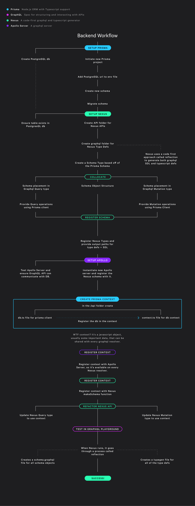

# Prisma with Nexus and Graphql

This project provides a simple boiler plate for using [Prisma](https://www.prisma.io/), with [Nexus](https://nexusjs.org/), [GraphQL](https://graphql.org/), and Apollo Server.

## What are these technologies?

- Prisma is an ORM (Object Relational Mapper) that provides a rich set of type safe APIs for interacting with a SQL database.

- Nexus is a [code-first](https://www.prisma.io/blog/announcing-the-release-of-nexus-schema-v1-b5eno5g08d0b#:~:text=Nexus%20is%20a%20library%20originally,has%20helped%20shape%20its%20evolution), schema generator that provides type safe APIs for creating graphql schemas and mutations. When Nexus runs, it goes through a process called [reflection](https://nexusjs.org/docs/getting-started/tutorial/chapter-writing-your-first-schema#reflection), which will generate two files:

  - `nexus-typegen.ts`: a type definition file that incorporates all of your schemas and CRUD ops.
  - `schema.graphql`: a traditional SDL (schema defined language) file

- GraphQL is a spec for structuring and interacting with APIs. It's big benefit is:

  - a single endpoint (usually `/graphql`) for interacting with an API
  - it's self-defining (when it's written it tells you exactly what you will get back)

- Apollo Server is a graphql server that provides exactly that. Just give it a graphql schema and a port and boom! You've got a running GraphQL server that you can interact with using the `POST` Method.

## Why Nexus?

When working with Prisma and GraphQL, I didn't know I needed something like Nexus. Then I discovered the concept of code-first. Originally, I would write the GraphQL as an SDL in one file and then go through the strenuous process of mapping the Schema to their resolvers in another file. This was time-intensive and bug prone. But Nexus solves this problem, and much more. Here's how:

### Code First:

Nexus provides a code-first approach to graphql. So you write code, usually in OOP fashion, to create your graphql schemas and mutations.

### Great Typescript Support:

Nexus transpiles that code on the fly to generate type definitions. This provides strong type support, intellisense, and auto-complete in vscode!

### Single ource of Truth:

Previously with SDL, schemas we're kept in separate files from Queries and Mutations. This was bug prone and time intensive. Nexus cuts out all of this mapping, and allows collocation of schemas, mutations, and queries in the same file.

### Prisma Integration

Nexus is ORM agnostic, which means it can leverage most ORMs including Prisma. By providing Prisma to the Apollo Server context, it can be used in all Nexus resolvers.

### Prisma Nexus Plugin

Prisma is currently developing an official [Prisma Nexus plugin](https://github.com/prisma/nexus-prisma). The idea is to provide optimizations specifically tailored to Prisma. They recommend not using in production just yet, so for now I haven't included it.

## Wiring all of these up

I have included a flow chart for how all of these pieces get wired up.

